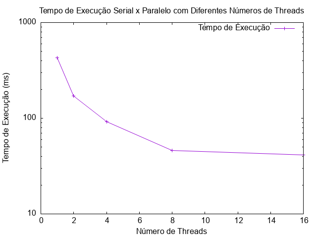
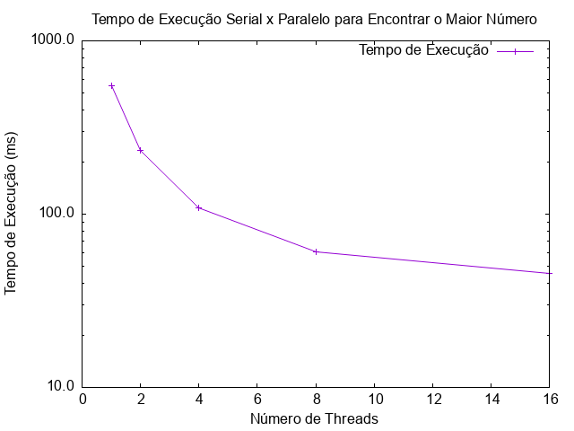

# OpenMP Practice

Este repositório contém práticas e exemplos de código para explorar e analisar o uso do OpenMP (Open Multi-Processing), uma API de suporte a múltiplas plataformas para programação paralela em C, C++ e Fortran. O OpenMP simplifica a programação de aplicativos paralelos, permitindo que os desenvolvedores escrevam código paralelo em uma linguagem de alto nível e execute em sistemas compartilhados de memória de forma eficiente.

## Paralelização e OpenMP

A paralelização é uma técnica na computação que permite a execução simultânea de partes independentes de um programa para melhorar o desempenho e a eficiência. O OpenMP oferece diretivas de compilação, funções de biblioteca e variáveis de ambiente para suportar a criação de aplicativos paralelos em sistemas compartilhados de memória.

## Como Executar o Projeto

### Passo 1: Clonar o Repositório

Para começar, clone este repositório para o seu ambiente local:

```
git clone https://github.com/seu_usuario/openmp_practice.git
```

### Passo 2: Instalar Dependências

Antes de compilar e executar os exemplos, certifique-se de que as dependências estejam instaladas em seu sistema:

- **Para Mac**: Instale as bibliotecas e compilador necessários usando Homebrew:

  ```
  brew install gcc libomp gdb
  ```

- **Para Windows**: Você pode usar o MinGW. Certifique-se de que o compilador GCC e a biblioteca OpenMP estão instalados.

### Passo 3: Compilar e Executar

Agora, compile e execute os exemplos fornecidos. Por exemplo, para o código abaixo:

```cpp
/usr/local/bin/g++-<versao_do_seu_gnd> -g -fopenmp -o seu_programa <atividade>.cpp
./seu_programa
```

No Windows, você pode usar:

```cpp
g++ -fopenmp -o seu_programa.exe tutorial.cpp
seu_programa.exe
```

Lembre-se de adaptar os comandos e variáveis de ambiente conforme o seu sistema operacional.

## Atividades

### omp_activity_week7.cpp (Semana 7)

Na atividade da Semana 7, implementamos um programa em C que calcula a soma dos elementos de um vetor usando o OpenMP. O código paraleliza o cálculo da soma usando diretivas OpenMP, permitindo que o processamento seja distribuído entre várias threads.

#### Código:

```c
#include <stdio.h>
#include <stdlib.h>
#include <omp.h>

#define N 200000000 // Tamanho do vetor

// Função para inicializar o vetor com números aleatórios
void initialize_vector(int *vector, int size) {
    for (int i = 0; i < size; i++) {
        vector[i] = rand() % 100; // Números aleatórios de 0 a 99
    }
}

// Função para calcular a soma dos elementos de um vetor de forma serializada
int serial_sum(int *vector, int size) {
    int sum = 0;
    for (int i = 0; i < size; i++) {
        sum += vector[i];
    }
    return sum;
}

int main() {
    int *vector = (int *)malloc(N * sizeof(int));

    // Inicialização do vetor com números aleatórios
    initialize_vector(vector, N);

    FILE *fp = fopen("results/data.txt", "w"); // Abrir arquivo para escrever os resultados
    if (fp == NULL) {
        printf("Erro ao abrir arquivo para escrever os resultados.\n");
        return 1;
    }

    // Versão serializada
    double start_time = omp_get_wtime();
    int sum_serial = serial_sum(vector, N);
    double end_time = omp_get_wtime();
    fprintf(fp, "1 %.5f\n", end_time - start_time);

    // Versão paralela
    for (int num_threads = 2; num_threads <= 16; num_threads *= 2) {
        omp_set_num_threads(num_threads);
        start_time = omp_get_wtime();
        int sum = 0;

        // Paralelização do loop para calcular a soma
        #pragma omp parallel for reduction(+:sum)
        for (int i = 0; i < N; i++) {
            sum += vector[i];
        }

        end_time = omp_get_wtime();
        fprintf(fp, "%d %.5f\n", num_threads, end_time - start_time);
    }

    fclose(fp);
    free(vector);

    // Chamar o script Gnuplot para plotar o gráfico
    system("gnuplot -persist results/plot_script.gnu");

    return 0;
}
```

#### Resultados e Discussão:

Os resultados dos tempos de execução para diferentes números de threads foram registrados no arquivo `results/data_0.txt`. Eles foram plotados em um gráfico para análise visual.

<p align="center">
  
</p>

A partir do gráfico acima, podemos observar o desempenho do algoritmo de soma serial em comparação com a versão paralela para diferentes números de threads.

- Quando utilizamos apenas uma thread (serial), o tempo de execução é mais longo, indicando que a computação ocorre de forma sequencial e, portanto, mais lenta.
- Conforme aumentamos o número de threads na versão paralela, o tempo de execução diminui significativamente. Isso ocorre porque mais threads estão disponíveis para processar o trabalho em paralelo, resultando em uma execução mais rápida.
- No entanto, após um certo ponto, adicionar mais threads não oferece benefícios adicionais de desempenho. No gráfico, observamos que o tempo de execução diminui rapidamente com o aumento do número de threads até cerca de 8 threads. Depois disso, as melhorias no tempo de execução se tornam menos significativas à medida que mais threads são adicionadas.

Aqui está a tabela com os dados de tempo:


<p align="center">
<table align="center">
    <tr>
    <th>Número de Threads</th>
    <th>Tempo (s)</th>
    </tr>
    <tr align="center">
    <td>1</td>
    <td>0.47792</td>
    </tr>
    <tr align="center">
    <td>2</td>
    <td>0.17367</td>
    </tr>
    <tr align="center">
    <td>4</td>
    <td>0.09395</td>
    </tr>
    <tr align="center">
    <td>8</td>
    <td>0.05204</td>
    </tr>
    <tr align="center">
    <td>16</td>
    <td>0.03802</td>
    </tr>
</table>
</p>
<p align="center">
<b>Tabela 1:</b> Tempos de Execução para Diferentes Números de Threads
</p>


O OpenMP permite paralelizar o cálculo da soma dos elementos de um vetor de forma eficiente, resultando em uma melhoria significativa no desempenho em comparação com a versão serial. No entanto, é importante encontrar um equilíbrio ao escolher o número de threads para evitar sobrecarga e obter o máximo de desempenho possível.

Com base na solicitação da atividade no Adalove seegue o [vídeo de execução e análise no youtube](www.google.com)

### omp_activity_week8.cpp (Semana 8)

Na atividade da Semana 8, implementamos um programa em C que procura o maior elemento de um vetor usando o OpenMP. O código paraleliza a busca usando diretivas OpenMP, permitindo que o processamento seja distribuído entre várias threads.

```c
#include <stdio.h>
#include <stdlib.h>
#include <omp.h>

#define N 200000000 // Tamanho do vetor

// Função para inicializar o vetor com números aleatórios
void initialize_vector(int *vector, int size) {
    for (int i = 0; i < size; i++) {
        vector[i] = rand() % 100; // Números aleatórios de 0 a 99
    }
}

// Função para encontrar o maior número no vetor de forma serializada
int serial_max(int *vector, int size) {
    int max = vector[0];
    for (int i = 1; i < size; i++) {
        if (vector[i] > max) {
            max = vector[i];
        }
    }
    return max;
}

int main() {
    int *vector = (int *)malloc(N * sizeof(int));

    // Inicialização do vetor com números aleatórios
    initialize_vector(vector, N);

    FILE *fp = fopen("results/data_1.txt", "w"); // Abrir arquivo para escrever os resultados
    if (fp == NULL) {
        printf("Erro ao abrir arquivo para escrever os resultados.\n");
        return 1;
    }

    // Versão serializada
    double start_time = omp_get_wtime();
    int max_serial = serial_max(vector, N);
    double end_time = omp_get_wtime();
    fprintf(fp, "1 %.5f\n", end_time - start_time);

    // Versão paralela
    for (int num_threads = 2; num_threads <= 16; num_threads *= 2) {
        omp_set_num_threads(num_threads);
        start_time = omp_get_wtime();
        int max = vector[0];

        // Paralelização do loop para encontrar o maior número
        #pragma omp parallel for reduction(max:max)
        for (int i = 1; i < N; i++) {
            if (vector[i] > max) {
                max = vector[i];
            }
        }

        end_time = omp_get_wtime();
        fprintf(fp, "%d %.5f\n", num_threads, end_time - start_time);
    }

    fclose(fp);
    free(vector);

    // Chamar o script Gnuplot para plotar o gráfico
    system("gnuplot -persist results/plot_script_1.gnu");

    return 0;
}
```

#### Resultados e Discussão:

Os resultados dos tempos de execução para diferentes números de threads foram registrados no arquivo `results/data_1.txt`. Eles foram plotados em um gráfico para análise visual.

<p align="center">
  
</p>

A partir do gráfico acima, podemos observar o desempenho do algoritmo de soma serial em comparação com a versão paralela para diferentes números de threads.

- Quando utilizamos apenas uma thread (serial), o tempo de execução é mais longo, indicando que a computação ocorre de forma sequencial e, portanto, mais lenta.
- Conforme aumentamos o número de threads na versão paralela, o tempo de execução diminui significativamente. Isso ocorre porque mais threads estão disponíveis para processar o trabalho em paralelo, resultando em uma execução mais rápida.
- No entanto, após um certo ponto, adicionar mais threads não oferece benefícios adicionais de desempenho. No gráfico, observamos que o tempo de execução diminui rapidamente com o aumento do número de threads até cerca de 8 threads. Depois disso, as melhorias no tempo de execução se tornam menos significativas à medida que mais threads são adicionadas.

Aqui está a tabela com os dados de tempo:

<table align="center">
    <tr>
    <th>Número de Threads</th>
    <th>Tempo (s)</th>
    </tr>
    <tr align="center">
    <td>1</td>
    <td>0.54823</td>
    </tr>
    <tr align="center">
    <td>2</td>
    <td>0.23245</td>
    </tr>
    <tr align="center">
    <td>4</td>
    <td>0.10881</td>
    </tr>
    <tr align="center">
    <td>8</td>
    <td>0.06046</td>
    </tr>
    <tr align="center">
    <td>16</td>
    <td>0.04566</td>
    </tr>
</table>

O OpenMP permite paralelizar a busca de elementos de um vetor de forma eficiente, resultando em uma melhoria significativa no desempenho em comparação com a versão serial. No entanto, é importante encontrar um equilíbrio ao escolher o número de threads para evitar sobrecarga e obter o máximo de desempenho possível.

Com base na solicitação da atividade no Adalove seegue o [vídeo de execução e análise no youtube](www.google.com)

